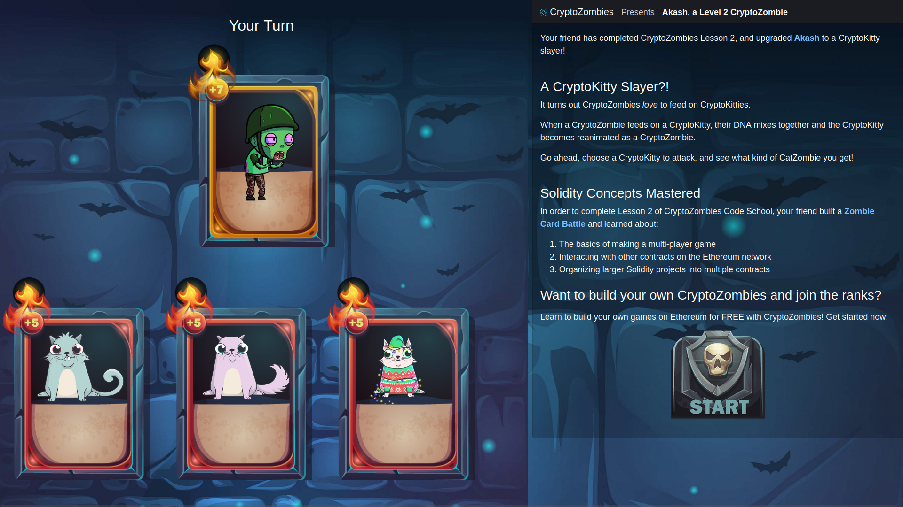

# making_the_zombie_factory



## Overview

This repository contains source codes for [Cryptozombies](https://cryptozombies.io/en/) lessons.

You can see the commit history for corresponding chapter codes.

## How To Use
You can simply clone the project to your local storage with following command:

```
git clone https://github.com/jaiakash/cryptozombies_solidarity_web3.git
```

Or fork it to modify the sample codes for your own study.

If you found any error in the codes while you study, Feel free to submit pull requests or issues.

## Result 
Final image - https://share.cryptozombies.io/en/lesson/2/share/Akash?id=Y3p8NTM2NDYy